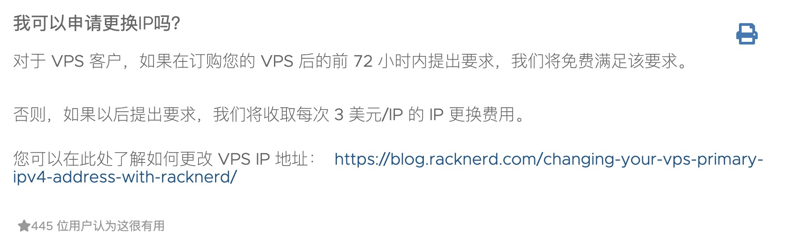
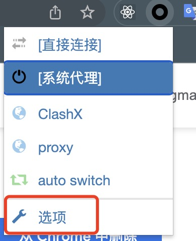
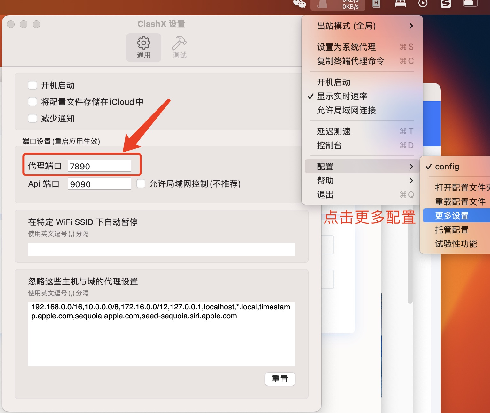
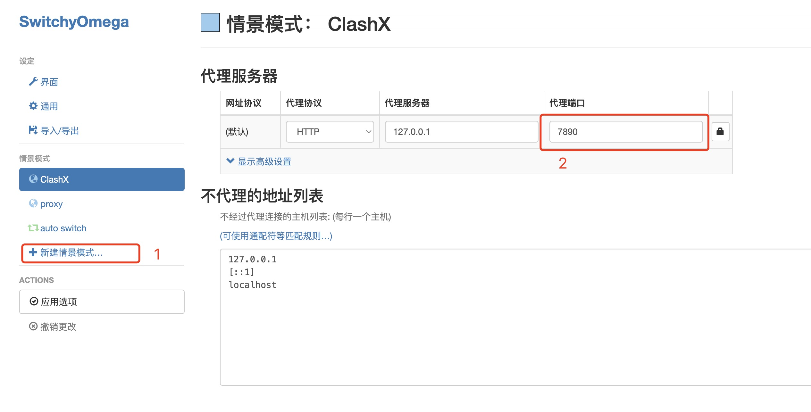
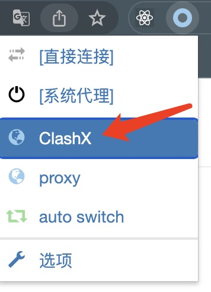

# 如何使用VPS搭建梯子

## 免责声明（写在开头）

本教程仅供学术研究和技术交流使用，旨在提高网络技术的理解和掌握，不得用于任何非法目的。作者不对任何人因使用本教程而产生的任何直接或间接的损失或责任负责。

请注意，根据中华人民共和国相关法律和法规，未经许可，不得建立、使用、提供或者进行传播用于非法获取、使用网络信息的技术手段，否则将可能构成违法行为。在使用本教程时，您有责任确保您的行为符合您所在地的法律法规。

如果您选择使用本教程，您将自行承担所有风险。作者对于由于使用或无法使用本教程所引起的任何形式的损失或损害，包括但不限于直接、间接、特殊、偶然、惩罚性或后果性的损失或损害，概不负责。

在使用本教程之前，请确保您已经充分理解了以上内容。如果您不能接受以上任何一点，请立即停止使用本教程。

## 整体流程

梯子的原理如下图所示，其实就是通过一个负责中转的服务器。

```bash
本地设备 (你的电脑或手机)
    |
    | (代理客户端将网络请求转发到代理服务器)
    V
代理服务器 (你在 VPS 上设置的 Shadowsocks 服务器)
    |
    | (代理服务器将网络请求发送到目标服务器，并将响应返回给代理客户端)
    V
目标服务器 (你想要访问的网站的服务器)
```

接下来，让我们从关键的代理服务器开始

## 代理服务器搭建

### 服务器购买

首先，我们需要一个国外的服务器去承载我们的Shadowsocks服务，来中转设备的请求。所以该服务器必须具有**中国国内可ping通**且**可以访问目标服务器**。

我推荐购买Racknerd家的服务器，很大一个原因就是便宜，被封后或者跑路后，成本可控（当然这里说的是最差情况-_-||）

我买的这款[768 MB KVM VPS](https://my.racknerd.com/aff.php?aff=8266&pid=695)一年才$10.28，带一个专用的IPv4地址，每个月1000GB公共网络端口，完整的root权限，以及10G SSD，其余配置可以自己点入商品详情查看。

如果1000GB一个月还无法满足，还有以下款可以选择（仅列举部分关键信息）：

- [1.5GB KVM VPS](https://my.racknerd.com/aff.php?aff=8266&pid=696)
  - 价格：$16.88/年
  - 流量：3000GB/月
  - 存储：30 GB PURE SSD RAID-10 Storage
- [2.5GB KVM VPS](https://my.racknerd.com/aff.php?aff=8266&pid=697)
  - 价格：$28.55/年
  - 流量：7000GB/月
  - 存储：60 GB PURE SSD RAID-10 Storage
- [3.5GB KVM VPS](https://my.racknerd.com/aff.php?aff=8266&pid=698)
  - 价格：$38.88/年
  - 流量：10,000GB/月
  - 存储：80 GB PURE SSD RAID-10 Storage

### 检查连接性&可访问性

完成购买流程后，你就可以在你的邮箱中收到Racknerd发送给你邮件，里面带有你的服务器ip和密码！

#### 检查国内是否可以ping通

拿到ip后，我们先用使用[站长之家的ping工具](https://ping.chinaz.com/)来进行检测，看看国内是否可以ping通该ip。

如果无法ping通！Racknerd允许在购买后72小时内提出要求，此时是免费的。如果过了这个时间的话，则需要花费$3来进行更换。

更换ip详见官方提供的[指引操作流程](https://blog.racknerd.com/changing-your-vps-primary-ipv4-address-with-racknerd/)。



#### 检查网站的可访问性

这里给一个mac登录的例子，windows登录vps的方式可以自行google或百度

```bash
# 将your_server_ip换成邮件内的ip，点击回车后，再输入你的密码即可
ssh root@your_server_ip
```

然后自行根据你需要访问的网站，在机器上进行curl测试

```bash
# 这里用chat.opanai.com来举例
curl https://chat.openai.com

# 以下是返回网站html结构，如果没有your ip have been blocked，就可以进行访问
# <html>
#   <head>
#     <style global>body{font-family:Arial,Helvetica,sans-serif}.container{align-items:center;display:flex;flex-direction:column;gap:2rem;height:100%;justify-content:center;width:100%}@keyframes enlarge-appear{0%{opacity:0;transform:scale(75%) rotate(-90deg)}to{opacity:1;transform:scale(100%) rotate(0deg)}}.logo{color:#8e8ea0}.scale-appear{animation:enlarge-appear .4s ease-out}@media (min-width:768px){.scale-appear{height:48px;width:48px}}.data:empty{display:none}.data{border-radius:5px;color:#8e8ea0;text-align:center}@media (prefers-color-scheme:dark){body{background-color:#343541}.logo{color:#acacbe}}</style>

# </head>
#   <body>
#     <div class="container">
#       <div class="logo">
#         <svg
#           width="41"
#           height="41"
#           viewBox="0 0 41 41"
#           fill="none"
#           xmlns="http://www.w3.org/2000/svg"
#           strokeWidth="2"
#           class="scale-appear"
#         >
#           <path
#             d="M37.5324 16.8707C37.9808 15.5241 38.1363 14.0974 37.9886 12.6859C37.8409 11.2744 37.3934 9.91076 36.676 8.68622C35.6126 6.83404 33.9882 5.3676 32.0373 4.4985C30.0864 3.62941 27.9098 3.40259 25.8215 3.85078C24.8796 2.7893 23.7219 1.94125 22.4257 1.36341C21.1295 0.785575 19.7249 0.491269 18.3058 0.500197C16.1708 0.495044 14.0893 1.16803 12.3614 2.42214C10.6335 3.67624 9.34853 5.44666 8.6917 7.47815C7.30085 7.76286 5.98686 8.3414 4.8377 9.17505C3.68854 10.0087 2.73073 11.0782 2.02839 12.312C0.956464 14.1591 0.498905 16.2988 0.721698 18.4228C0.944492 20.5467 1.83612 22.5449 3.268 24.1293C2.81966 25.4759 2.66413 26.9026 2.81182 28.3141C2.95951 29.7256 3.40701 31.0892 4.12437 32.3138C5.18791 34.1659 6.8123 35.6322 8.76321 36.5013C10.7141 37.3704 12.8907 37.5973 14.9789 37.1492C15.9208 38.2107 17.0786 39.0587 18.3747 39.6366C19.6709 40.2144 21.0755 40.5087 22.4946 40.4998C24.6307 40.5054 26.7133 39.8321 28.4418 38.5772C30.1704 37.3223 31.4556 35.5506 32.1119 33.5179C33.5027 33.2332 34.8167 32.6547 35.9659 31.821C37.115 30.9874 38.0728 29.9178 38.7752 28.684C39.8458 26.8371 40.3023 24.6979 40.0789 22.5748C39.8556 20.4517 38.9639 18.4544 37.5324 16.8707ZM22.4978 37.8849C20.7443 37.8874 19.0459 37.2733 17.6994 36.1501C17.7601 36.117 17.8666 36.0586 17.936 36.0161L25.9004 31.4156C26.1003 31.3019 26.2663 31.137 26.3813 30.9378C26.4964 30.7386 26.5563 30.5124 26.5549 30.2825V19.0542L29.9213 20.998C29.9389 21.0068 29.9541 21.0198 29.9656 21.0359C29.977 21.052 29.9842 21.0707 29.9867 21.0902V30.3889C29.9842 32.375 29.1946 34.2791 27.7909 35.6841C26.3872 37.0892 24.4838 37.8806 22.4978 37.8849ZM6.39227 31.0064C5.51397 29.4888 5.19742 27.7107 5.49804 25.9832C5.55718 26.0187 5.66048 26.0818 5.73461 26.1244L13.699 30.7248C13.8975 30.8408 14.1233 30.902 14.3532 30.902C14.583 30.902 14.8088 30.8408 15.0073 30.7248L24.731 25.1103V28.9979C24.7321 29.0177 24.7283 29.0376 24.7199 29.0556C24.7115 29.0736 24.6988 29.0893 24.6829 29.1012L16.6317 33.7497C14.9096 34.7416 12.8643 35.0097 10.9447 34.4954C9.02506 33.9811 7.38785 32.7263 6.39227 31.0064ZM4.29707 13.6194C5.17156 12.0998 6.55279 10.9364 8.19885 10.3327C8.19885 10.4013 8.19491 10.5228 8.19491 10.6071V19.808C8.19351 20.0378 8.25334 20.2638 8.36823 20.4629C8.48312 20.6619 8.64893 20.8267 8.84863 20.9404L18.5723 26.5542L15.206 28.4979C15.1894 28.5089 15.1703 28.5155 15.1505 28.5173C15.1307 28.5191 15.1107 28.516 15.0924 28.5082L7.04046 23.8557C5.32135 22.8601 4.06716 21.2235 3.55289 19.3046C3.03862 17.3858 3.30624 15.3413 4.29707 13.6194ZM31.955 20.0556L22.2312 14.4411L25.5976 12.4981C25.6142 12.4872 25.6333 12.4805 25.6531 12.4787C25.6729 12.4769 25.6928 12.4801 25.7111 12.4879L33.7631 17.1364C34.9967 17.849 36.0017 18.8982 36.6606 20.1613C37.3194 21.4244 37.6047 22.849 37.4832 24.2684C37.3617 25.6878 36.8382 27.0432 35.9743 28.1759C35.1103 29.3086 33.9415 30.1717 32.6047 30.6641C32.6047 30.5947 32.6047 30.4733 32.6047 30.3889V21.188C32.6066 20.9586 32.5474 20.7328 32.4332 20.5338C32.319 20.3348 32.154 20.1698 31.955 20.0556ZM35.3055 15.0128C35.2464 14.9765 35.1431 14.9142 35.069 14.8717L27.1045 10.2712C26.906 10.1554 26.6803 10.0943 26.4504 10.0943C26.2206 10.0943 25.9948 10.1554 25.7963 10.2712L16.0726 15.8858V11.9982C16.0715 11.9783 16.0753 11.9585 16.0837 11.9405C16.0921 11.9225 16.1048 11.9068 16.1207 11.8949L24.1719 7.25025C25.4053 6.53903 26.8158 6.19376 28.2383 6.25482C29.6608 6.31589 31.0364 6.78077 32.2044 7.59508C33.3723 8.40939 34.2842 9.53945 34.8334 10.8531C35.3826 12.1667 35.5464 13.6095 35.3055 15.0128ZM14.2424 21.9419L10.8752 19.9981C10.8576 19.9893 10.8423 19.9763 10.8309 19.9602C10.8195 19.9441 10.8122 19.9254 10.8098 19.9058V10.6071C10.8107 9.18295 11.2173 7.78848 11.9819 6.58696C12.7466 5.38544 13.8377 4.42659 15.1275 3.82264C16.4173 3.21869 17.8524 2.99464 19.2649 3.1767C20.6775 3.35876 22.0089 3.93941 23.1034 4.85067C23.0427 4.88379 22.937 4.94215 22.8668 4.98473L14.9024 9.58517C14.7025 9.69878 14.5366 9.86356 14.4215 10.0626C14.3065 10.2616 14.2466 10.4877 14.2479 10.7175L14.2424 21.9419ZM16.071 17.9991L20.4018 15.4978L24.7325 17.9975V22.9985L20.4018 25.4983L16.071 22.9985V17.9991Z"
#             fill="currentColor"
#           />
#         </svg>
#       </div>
#       <div class="data"><form id="challenge-form" class="challenge-form" action="/?__cf_chl_f_tk=hFeq0J_lCNYUGv0dw5T1_7oMyzFUh3.raYLB3SS.VnU-1685611672-0-gaNycGzNCRA" method="POST" enctype="application/x-www-form-urlencoded">
#     <div id="cf-please-wait">
#         <div id="spinner">
#             <div id="cf-bubbles">
#                 <div class="bubbles"></div>
#                 <div class="bubbles"></div>
#                 <div class="bubbles"></div>
#             </div>
#         </div>
#         <p id="cf-spinner-please-wait">Please stand by, while we are checking your browser...</p>
#         <p id="cf-spinner-redirecting" style="display:none">Redirecting...</p>
#     </div>
#     <input type="hidden" name="md" value="kKSS8HRcsEtrffLWwYhQl5Bqby6.BJOYB7VQYxeKs5g-1685611672-0-AVOXF8TsyWq3eRSfjQw5YMyHB1GASuzQ_pqEL9IK3ddIYhYT1E9EdmNJwR16Gn4kV7HX3ki4U5IBBxVuhfhYe2b23UTI7BVKZCdDe0xD5va5cPxHzXGLpbg-AO5iUJRXfBSDMRSdniTL7mbmCceW7sfQPyEIZ0_Sd5Vn6vaDlZ_9oMSOp2ejTGqBEUBhx1oULfK4Ff6ELQQSbes5sFMA6LMxLipYLkUIIsxtiVpmcfqtbIvVlWwBJVXFLkIR10EHi8UQ04q35zPzbqlQzTOh9k3YvEZivkwI7imjI4P-n6WXXkduBAP7N458u5LF3QfCCTBiuubgivIS6D5fjM8mjkmteby5vhZS5ZwegrQSrGxdHJeZVR5cs7nDGi6yw5aPsMqHpeKKi7Blz77uLosnIUHZCcs2qMM_eHDgcYQewYx5yGjFMuyYexzm0rhME-j0b5fbQZnUSuGIO6ossMqQxD0rGkn7_ZSrgTUiRqmJi6u60KlRjYckvY5B5osNbmRd7N7TM9sYScsvLZHaYkPUxm8fk0W6L2wb2fAvAPJ1Xgui-8HndZAd69PzAcLscEzlGiIj-yKs5Bwyp2s_GiIv37f4XcI-77OWxItWGwQ438lTjcqXjFL38pjFZd0vwWMqjZfX5EoiAUNhS2kcmoDUbQLDjrII7YrkCbt-TbRLF1-1YFfN5ORW_5eKFj_VHMe6-dvGPl96XcYPmbSPBJ0PEU724nb1NGiYKF4yyXnAwZnRXcfco2oP51KqYygONFIJ5GEjqC89bChYKuWtheP2bczur0OdOfckHZb0a7J6nhmshRK1bbB1uFLNpYQc75t7LiYez2j_XvjJi1fwEkC3nLI2C8FM8gLpAaIYIqsYDKJa4CjtoxF2aSTwTjQsjJu-tVQTyYaomadkZu82jB9Nu4_PXO2-pU1fGttRNpf0AhWBTH0YpDAv1kJ7CRfYy-PAginynuwJk0kuyQhG16FWdzepiBm1IViuPbvvPvuEUBfx8i3516_67p-sxJKRSeVj0rcerPrK8lnSstAQvyWsOXJw3ZZosIpyEUuCntCqVvwlOhzjkOyHd6Hd4sRaf-q7UzLQd1AHvoP0XjlryzRLH0upB5KAULOQpGUDSmHGfgSCep9mybv0g0LP7wO83diEZaq5ZmQMSqZaQ69JpL5WhJDu8d4dQ5ZRGyxZOEtU5xgph3s6qKfWUFJL72FoX5wgx6m8i1G2itxgDEemLIaaelYf1THiK1NLWh1fcOqjvKQ1SToHLwurkbhUFPRJ9qduDLx87MOQX2g0DRuM9kITEr9WoA3k0cIEtQ3RlnaAOPmurlwbmEA8QclctR9wTw__30YYzvtIiv59zxwrNf1OHrN11hBhXiXe3U-9UN44VrDwy0FR0O14Dq1MBgctGdSb4pOaB5yxRYRaXTcKqWDE1oFFg-QvdphieVxaBV7SgnTRoNDHkoj7yK4uVLVFjrs06glnD9_hTVW8zWJ4Lx66uODVvHByxx_UAs6DxSz2i30_ArU-sJWOBZA42R-7nlpEIuhI5sKASCtIYFZwVPWz399Od1U1EC-u6ryUhffq6KMYhIFu4fnXQ-DlcoY07Rfi9u2DosfONG7-DPovc912mMUGct-90bIruVq_CUBidc6i3lD7MmqjroyUUhQ-duDFbjolxjhYIgVUJR82EMMx-cvV9wc2U8eyOkJo-nUZNZ-7mohmtMonx2Yg5wnhgv5Xd2AnkS9CXAj_QRxPrdQkpJpnKfteFRzAzazfRLZRgM5mGaCXHUno-glHEwgE3panZcXTSOgzHmp_kKTa0QYy6RCdpYISJ6IdZK422PSOAxI7Od2VKp35cmK_LlU_KcpR_ak_uPeYDsEivDzbnj4KYkbBiVnEMAKaUGPXinYscnWCvPmdt42zexvpV2_hK_J6O6uHf7G6ZewRVQhz2ESBtkHZqo1Yeau7Ydqlcbs78z-U76ZCCwLNQ3cHZxGWZshivgBRzDNGhmpv19TPrRa5IOGI68UC5dJiAjdiGxMxFjRkevcSkTo7oJNkkZPq9b-KHbM6OWU4zPSZpYUxx-F4MsD_j19d4F88bqCmB-h8-nB583BITs07Yg7_fp8_uinP-Jn-vBcrQpmitP9ORzSoxk6xkn7DHG_9pLESRvlx4mAPHzVEfza1XMsmOUwxHPvKfdckOXG8bkx9JXXM9WkcVhmdWDifMnrgdbS_aVxXTRu9VcsnbpeFUqy2g4Q5biPX9VCSZ-___R7DUpk5xQ1gO8g" />
#     <noscript id="cf-captcha-bookmark" class="cf-captcha-info">
#         <h1 style="color:#bd2426;">Please turn JavaScript on and reload the page.</h1>
#     </noscript>
#     <div id="no-cookie-warning" class="cookie-warning" style="display:none">
#         <p style="color:#bd2426;">Please enable Cookies and reload the page.</p>
#     </div>
#     <div id="trk_jschal_js" style="display:none;background-image:url('/cdn-cgi/images/trace/managed/nojs/transparent.gif?ray=7d066c591c40fa1a')"></div>
# </form>
# <script>
#     (function(){
#         window._cf_chl_opt={
#             cvId: '2',
#             cZone: 'chat.openai.com',
#             cType: 'managed',
#             cNounce: '13633',
#             cRay: '7d066c591c40fa1a',
#             cHash: '397139dda58b0e7',
#             cUPMDTk: "\/?__cf_chl_tk=hFeq0J_lCNYUGv0dw5T1_7oMyzFUh3.raYLB3SS.VnU-1685611672-0-gaNycGzNCRA",
#             cFPWv: 'b',
#             cTTimeMs: '1000',
#             cMTimeMs: '0',
#             cTplV: 1,
#             cTplB: 'cf',
#             cK: "",
#             cRq: {
#                 ru: 'aHR0cHM6Ly9jaGF0Lm9wZW5haS5jb20vY2hhdC9mcm9udGVuZC8=',
#                 ra: 'Y3VybC83LjI5LjA=',
#                 rm: 'R0VU',
#                 d: 'yuLFO6jOwcjfykOQScPaj2+1UjCbuXpxeasfYEj2lF3dXk6IuPkQf2/qeRsU9KiULy8kF+9dB3YMMEAfyVWapAo6As7mDRy8467Ao7eIxC9J2mmpd6xRp7HJ7zOijPZlxmX4JqN/WSmFe1S4WOPfBiPv6d4Lqsl3WzqBoUoRPt4OyRASs8KcB5pGIcP1agp3k2tiC2okG5HtC7V3mcgvpZ703sAAr0kTEi9+gt/MpzKmd44e7PjlZmnmjU3CuyhqFp6EXqZG3ruEH8NTwCOd6ChO9aNeM5iyPgX+wDW0CICC3O6+x1qbvkJGCceeluzZQ+rly9uZ+LcWl2+L/LPLj5NkkNkwFAARoxsAC9M2O338VFH6qahkAANNcn4aJ/jD5gqD4QhKHuZ8KSdIPwuhIgJK8CX+Od9RK2lL7eqdUpNxr9IcSpDgulQHbadsxLrzXDggXQnWjMP3l2rkNgj+oQ9SEE04hMZdZNaQxffTpZZ4C3jOVGWKCksTst4v4LHapMxTNcCFMaeTN08RmrhK5wLT6E4rKn/0lf1IdquU7oE3KcfpuBFBn0gLdEr/A5BHewX2BYYu+Zu0E/fjjaQn8nuHK6QrO5DwR/Dm8/4B7qREOTqxr7+UUeAUqpd3vYC1',
#                 t: 'MTY4NTYxMTY3Mi40OTkwMDA=',
#                 m: 'rrkd/u3W9mXoaIFYBygPqnIGtZjAp4R827g444a9HwM=',
#                 i1: '9eZsjhi01tOkZMo3mTBI+g==',
#                 i2: 'Z0HMi1e1OIzA8md+2aMt/w==',
#                 zh: 'iuyN59AGNgeBFFEOPj72EN+xtBfXXvoCyd1dJnIVFAc=',
#                 uh: 'lfaOk+NyH74GFUMHeUy9vGmMwLK+UFwcpaGCL1YImrk=',
#                 hh: 'foaWmAUHGGlVCZaNUJIHhxzxFNzSPNnVe6rJjiQw728=',
#             }
#         };
#         var trkjs = document.createElement('img');
#         trkjs.setAttribute('src', '/cdn-cgi/images/trace/managed/js/transparent.gif?ray=7d066c591c40fa1a');
#         trkjs.setAttribute('alt', '');
#         trkjs.setAttribute('style', 'display: none');
#         document.body.appendChild(trkjs);
#         var cpo = document.createElement('script');
#         cpo.src = '/cdn-cgi/challenge-platform/h/b/orchestrate/managed/v1?ray=7d066c591c40fa1a';
#         window._cf_chl_opt.cOgUHash = location.hash === '' && location.href.indexOf('#') !== -1 ? '#' : location.hash;
#         window._cf_chl_opt.cOgUQuery = location.search === '' && location.href.slice(0, location.href.length - window._cf_chl_opt.cOgUHash.length).indexOf('?') !== -1 ? '?' : location.search;
#         if (window.history && window.history.replaceState) {
#             var ogU = location.pathname + window._cf_chl_opt.cOgUQuery + window._cf_chl_opt.cOgUHash;
#             history.replaceState(null, null, "\/?__cf_chl_rt_tk=hFeq0J_lCNYUGv0dw5T1_7oMyzFUh3.raYLB3SS.VnU-1685611672-0-gaNycGzNCRA" + window._cf_chl_opt.cOgUHash);
#             cpo.onload = function() {
#                 history.replaceState(null, null, ogU);
#             };
#         }
#         document.getElementsByTagName('head')[0].appendChild(cpo);
#     }());
# </script>

# </div>
#     </div>
#   <script>!function(){var e=document.createElement("iframe");function t(){var t=e.contentDocument||e.contentWindow.document;if(t){var n=t.createElement("script");n.nonce="",n.innerHTML="window['__CF$cv$params']={r:'79271b319741fa72',m:'sCXwl7Hde_jVE6GIOe0wKz4oMt3Lh8w0Eua1mDgehB0-1675216960-0-AYp1IKwNU5u8yMiuEYyoErcqoHVV4YDI+VMoX7mzAvt9fZ4EOB3++PlEm7wtksX3Xttwni3QWV/tKTeRlCy+/nY6nCAYRHzWlB1zXw1KXyx/+B5lo5mvtnyYfuCVVJEWfwzAUnF4MwJWDszLxIwECgs=',s:[0xb58b3307a5,0x39915b3715],u:'/cdn-cgi/challenge-platform/h/g'};var now=Date.now()/1000,offset=14400,ts=''+(Math.floor(now)-Math.floor(now%offset)),_cpo=document.createElement('script');_cpo.nonce='',_cpo.src='/cdn-cgi/challenge-platform/h/g/scripts/alpha/invisible.js?ts='+ts,document.getElementsByTagName('head')[0].appendChild(_cpo);",t.getElementsByTagName("head")[0].appendChild(n)}}if(e.height=1,e.width=1,e.style.position="absolute",e.style.top=0,e.style.left=0,e.style.border="none",e.style.visibility="hidden",document.body.appendChild(e),"loading"!==document.readyState)t();else if(window.addEventListener)document.addEventListener("DOMContentLoaded",t);else{var n=document.onreadystatechange||function(){};document.onreadystatechange=function(e){n(e),"loading"!==document.readyState&&(document.onreadystatechange=n,t())}}}();</script></body>
# </html>
```

### 服务器上的中转服务搭建

如果你的VPS是CentOS 7，那么你可以按照以下步骤安装和配置Shadowsocks：

#### 1. 安装Shadowsocks：
连接到VPS后，你需要安装Shadowsocks。在CentOS 7上，你可以使用以下命令安装Shadowsocks：

```bash
yum install python-setuptools && easy_install pip
pip install shadowsocks
```

##### 可能会遇到的问题
1. 如果遇到pip(python的包管理器)安装失败，则使用以下命令重新执行安装

```bash
# Python 2.7
curl "https://bootstrap.pypa.io/pip/2.7/get-pip.py" -o "get-pip.py"
python get-pip.py

# Python 3.7或更高版本执行以下命令
curl "https://bootstrap.pypa.io/get-pip.py" -o "get-pip.py"
python get-pip.py
```
安装完成后，再次执行shadowsocks的安装

```bash
# 安装
pip install shadowsocks

# 检测是否安装
pip show shadowsocks
```


#### 2. 配置Shadowsocks：
安装Shadowsocks后，你需要使用以下命令创建一个名为`/etc/shadowsocks.json`的文件

```bash
sudo touch /etc/shadowsocks.json
```
编辑该文件

```bash
sudo vi /etc/shadowsocks.json
# emmmm，具体的vi使用命令可以google，这里不做赘述
```

输入以下内容，替换`your_server_ip`和`your_password`为你自己的服务器IP和密码

```json
{
    "server":"your_server_ip",
    "server_port":8000,
    "local_address": "127.0.0.1",
    "local_port":1080,
    "password":"your_password",
    "timeout":300,
    "method":"aes-256-cfb",
    "fast_open": false
}
```

#### 3. 启动Shadowsocks:
配置完成后，你可以使用以下命令启动Shadowsocks：

```bash
# 启动
ssserver -c /etc/shadowsocks.json -d start

# 检查shadowsocks是否运行
ps -ef | grep ssserver
```

以下这步，可不弄，除非你要将其变为一个docker：

如果你希望Shadowsocks在系统启动时自动启动，你可以将上述命令添加到`/etc/rc.d/rc.local`文件中，并给予执行权限：

```bash
echo "ssserver -c /etc/shadowsocks.json -d start" >> /etc/rc.d/rc.local
chmod +x /etc/rc.d/rc.local
```

#### 4. 允许外部访问shadowsocks监听的端口：

这一步，我们需要开放vps的防火墙设置，允许外部请求访问某端口，不然中转服务器就无法收到请求。以上述设置的8000端口为例子：

在CentOS 7上，你可以使用`firewall-cmd`命令来管理防火墙规则。
1. 首先，你可以使用以下命令查看当前的防火墙规则：

```bash
sudo firewall-cmd --list-all
```

这个命令会显示当前的防火墙区域、接口、服务和端口。

2. 然后，你可以使用以下命令开放8000端口：

```bash
sudo firewall-cmd --permanent --add-port=8000/tcp
sudo firewall-cmd --permanent --add-port=8000/udp
```

这些命令会将8000端口添加到防火墙的允许列表中。`--permanent`选项表示这些规则是永久的，即使重启系统后也会保留。

3. 最后，你需要使用以下命令重新加载防火墙规则，这个命令会使新的防火墙规则立即生效

```bash
sudo firewall-cmd --reload
```

完成这些步骤后，你应该能够连接到服务器的8000端口了。

### 本地设备配置代理连接
在这步，我们需要本地设备（电脑等）进行代理配置，使得本机的请求能够发送到vps并中转到外网的目标服务器上。这里我们采用ClashX来进行示范

ClashX 是一款在 macOS 上使用的代理工具，它支持 Shadowsocks 协议。以下是如何在 ClashX 中设置 Shadowsocks 的步骤：

1. **下载并安装 ClashX**：如果你还没有安装 ClashX，你可以从其[官方GitHub页面](https://github.com/yichengchen/clashX/releases)下载最新版本的 ClashX，并按照提示进行安装。

2. **打开 ClashX**：安装完成后，打开 ClashX。你应该可以在你的菜单栏中看到一个小飞机的图标。

3. **进入配置页面**：点击菜单栏中的 ClashX 图标，然后选择 "配置" -> "打开配置文件夹"；然后点击编辑config.yaml文件。


4. **添加 Shadowsocks 配置**：在配置文件中，你需要添加一个新的代理配置。

```yaml
# 替换 `your_server_ip` 和 `your_password` 为你在服务器上设置的 IP 地址和密码
proxies:
  - name: "My Server"
    type: ss
    server: your_server_ip
    port: 8000
    cipher: aes-256-cfb
    password: your_password
```

5. **保存并应用配置**：添加完配置后，保存你的配置，点击菜单栏中的 ClashX 图标，然后选择 "配置" -> "重载配置文件"。

点开控制台，就可以在代理中，看到你刚设置好的server了，点击测速，如果可以测速成功，就说明已经连通了。


5. **选择代理模式**：在 ClashX 的菜单中，你可以选择 "全局代理" 。

6. **选择代理服务器**：你需要在 ClashX 的菜单中选择 "Proxies"，然后选择你刚刚添加的 Shadowsocks 服务器作为你的代理服务器。

7. **浏览器中使用代理插件**：最后，使浏览器的请求通过代理插件打向clashX的混合端口

这里以chrome浏览器为例子，首先在插件商场里下载[Proxy SwitchyOmega](https://chrome.google.com/webstore/detail/proxy-switchyomega/padekgcemlokbadohgkifijomclgjgif?hl=zh-CN)。

安装完成后，点击Proxy SwitchyOmega插件中的选项


记住在ClashX设置中的，代理端口号码


在Proxy SwitchyOmega设置界面，创建新的情景模式，设置如下图，将代理端口设置为ClashX中的混合端口即可，然后保存



最后在点击插件，选中刚刚创建好的情景模式的名字，就可以启动代理啦



以上就是如何使用VPS搭建梯子的过程啦，如有兴趣欢迎讨论~
